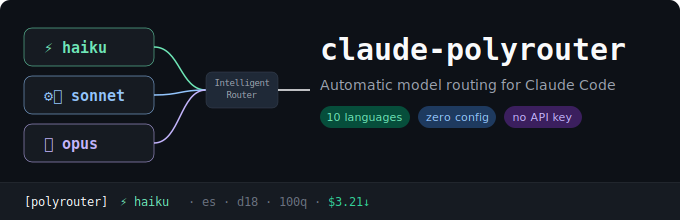

# claude-polyrouter


> Automatic model routing for Claude Code — sends each query to the optimal model tier based on complexity, without sacrificing quality.
>
> **10 languages · zero config · no API key · 82% token reduction · 501 tests passing**

---

## How It Routes

| Query | Tier | Model | Reason |
|-------|------|-------|--------|
| "hola" / "ok" / "what is X?" | Fast | Haiku | Short or simple question |
| "create a function" / "fix this bug" | Standard | Sonnet | Coding task |
| "design microservices architecture" | Deep | Opus | Complex analysis |

Routing happens automatically on every query via a `UserPromptSubmit` hook. No manual intervention needed.

---

## v1.4.0 Highlights

- **82% token reduction** — additionalContext reduced from ~150 tokens (v1.3) to ~27 tokens
- **100% classification accuracy** — 30/30 on multilingual test suite across all 10 languages
- **Multi-signal scoring** — 9-signal weighted engine replaces simple pattern counting
- **Poly mascot HUD** — Animated ASCII mascot with cache freshness bar, zero token cost
- **Auto-hook injection** — Zero-config installation, hooks configured automatically

---

## Features

- **Multi-signal scoring** — 9-signal weighted scoring engine (patterns, code blocks, error traces, file paths, prompt length, tool results, conversation depth, effort level, universal tech symbols)
- **10 languages** — English, Spanish, Portuguese, French, German, Russian, Chinese, Japanese, Korean, Arabic, plus Spanglish detection
- **Zero API keys** — Pure rule-based classification with pre-compiled regex patterns (~3ms latency)
- **Cost savings** — 50-80% reduction by routing simple queries to cheaper models
- **Two-level cache** — In-memory LRU + file-based persistent cache for repeated queries
- **Multi-turn awareness** — Detects follow-up queries and maintains conversation context
- **Dynamic effort** — Automatic effort level mapping (low/medium/high/max) based on routing tier
- **Cache keep-alive** — PostToolUse hook detects prompt cache expiration risk
- **Compact advisory** — Recommends context compaction when stale tool results accumulate
- **Poly mascot HUD** — Animated ASCII mascot in statusLine with 6 states, cache freshness bar, zero token cost
- **Project learning** — Optional knowledge base that fine-tunes routing per project
- **Analytics** — Terminal stats and HTML dashboard with Charts.js visualizations

---

## Installation

```bash
claude plugin add sonyharv/claude-polyrouter
```

That's it. The plugin auto-configures the `UserPromptSubmit` hook in your `settings.json`. No manual setup needed.

---

## HUD — Poly Mascot

Poly lives in your statusLine and shows routing state at zero token cost:

```
[polyrouter] [^.^]~ · sonnet · std · cache:█████ · $12.34↓ · es
```

### Mascot States

| State | Display | Meaning |
|-------|---------|---------|
| Idle | `[^.^]~` | Ready, all good |
| Routing | `[^o^]>>` | Classifying query |
| Thinking | `[^.^]...` | Claude processing |
| Keepalive | `[~_~]zzz` | Cache drowsy (>40 min) |
| Danger | `[°O°]!!!` | Cache about to expire (>50 min) |
| Compact | `[^.^]~~~` | Recommending compaction |

### Cache Freshness Bar

| Time | Display | Color | Meaning |
|------|---------|-------|---------|
| 0-10 min | `cache:█████` | Green | Fresh — cache is warm |
| 10-30 min | `cache:████░` | Yellow | Warm — still healthy |
| 30-50 min | `cache:███░░ !` | Orange | Warning — consider a query |
| 50+ min | `cache:░░░░░ exp` | Red | Expired — triggers danger state |

---

## Commands

| Command | Description |
|---------|-------------|
| `/polyrouter:route <tier> [query]` | Manual routing override |
| `/polyrouter:stats` | View routing statistics |
| `/polyrouter:dashboard` | Open HTML analytics dashboard |
| `/polyrouter:config` | Show active configuration |
| `/polyrouter:learn` | Extract routing insights from conversation |
| `/polyrouter:learn-on` | Enable continuous learning mode |
| `/polyrouter:learn-off` | Disable continuous learning mode |
| `/polyrouter:knowledge` | View knowledge base status |
| `/polyrouter:learn-reset` | Clear knowledge base |
| `/polyrouter:retry` | Retry with escalated tier |

---

## Configuration

Global config at `~/.claude/polyrouter/config.json`:

```json
{
  "default_level": "fast",
  "confidence_threshold": 0.7,
  "levels": {
    "fast":     { "model": "haiku",  "agent": "fast-executor" },
    "standard": { "model": "sonnet", "agent": "standard-executor" },
    "deep":     { "model": "opus",   "agent": "deep-executor" }
  },
  "scoring": {
    "thresholds": { "fast_max": 0.30, "standard_max": 0.65 }
  },
  "effort": { "auto": true },
  "keepalive": { "enabled": true, "threshold_minutes": 50 },
  "compact": { "enabled": true, "keep_last_n": 5 },
  "hud": { "mascot_enabled": true, "statusline_native": true }
}
```

Project override at `<project>/.claude-polyrouter/config.json`:

```json
{
  "default_level": "standard",
  "confidence_threshold": 0.8
}
```

When new models release, update config only — no code changes needed:

```json
{
  "levels": {
    "fast": { "model": "haiku-next", "agent": "fast-executor" }
  }
}
```

---

## How It Works

1. **Exception check** — Slash commands, meta-queries, and continuations bypass routing
2. **Intent override** — Natural language model forcing ("use opus") takes max priority
3. **Cache lookup** — Two-level cache (memory + file) for repeated queries
4. **Language detection** — Stopword-based scoring identifies the query language
5. **Pattern extraction** — Raw signal counting from language-specific regex patterns
6. **Multi-signal scoring** — Weighted 9-signal composite score maps to tier (fast <0.35, standard <0.65, deep >=0.65)
7. **Context boost** — Multi-turn awareness adjusts confidence for follow-up queries
8. **Learned adjustments** — Optional project knowledge base fine-tunes routing

---

## Supported Languages

| Language | Code | Notes |
|----------|------|-------|
| English | en | Native patterns |
| Spanish | es | Native patterns (accent-tolerant) |
| Portuguese | pt | Native patterns (accent-tolerant) |
| French | fr | Native patterns |
| German | de | Native patterns |
| Russian | ru | Native patterns (declension-aware) |
| Chinese | zh | Native patterns + CJK word counting |
| Japanese | ja | Native patterns (SOV word order) |
| Korean | ko | Native patterns + CJK word counting |
| Arabic | ar | Native patterns |
| Spanglish | en+es | Auto-detected |

To add a language: create `languages/<code>.json` with stopwords and patterns. Auto-discovered — no code changes needed.

---

## Roadmap v2

- [ ] Multi-agent support: Codex CLI, Gemini CLI
- [ ] Ultra tier for next-gen models
- [ ] Adaptive confidence thresholds from routing history
- [ ] Analytics export (CSV/JSON) for team reporting
- [ ] Weighted ensemble classification (rules + embeddings)
- [ ] Auto-escalation on repeated low-confidence routes

---

## Contributing

1. Fork the repository
2. Create a branch: `git checkout -b feat/my-feature`
3. Add tests in `tests/`
4. Run tests: `python -m pytest tests/ -v`
5. Submit a pull request with a clear description

Commit style: `feat:` `fix:` `refactor:` `test:` `docs:`

Keep classification latency under 5ms. Maintain test coverage for all routing paths.

---

## License

MIT — by [SonyHarv](https://github.com/SonyHarv)
